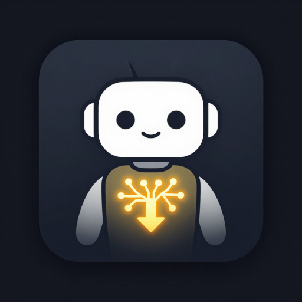
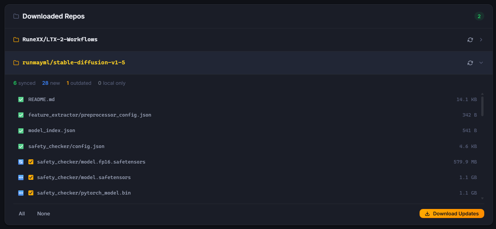
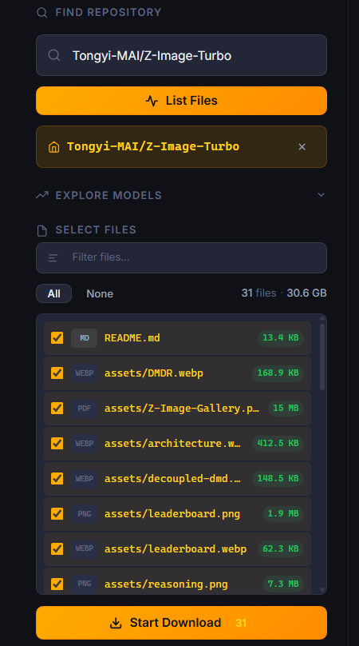
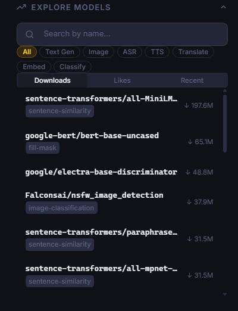

<p align="center">
  
</p>

# HF Model Downloader

A web UI to browse and download models from [HuggingFace Hub](https://huggingface.co), designed to run as a Docker container on Unraid (and any other Docker host).

| Main View | File Selection | Explore & Search |
|---|---|---|
|  |  |  |

## Features

- **Browse & Search** — Explore trending models, filter by type (text-gen, image, ASR, …) and sort by downloads, likes or date
- **File Selection** — List all files in a repo, filter and select individually before downloading
- **Download Queue** — Queue multiple repos, pause, resume and cancel at any time
- **Resume Support** — Interrupted downloads continue where they left off
- **Sync Status** — Compare local files against the remote repo (synced / outdated / local only)
- **Basic Auth** — Optional username/password protection via environment variables
- **HF Token** — Support for private and gated repositories (Llama, Gemma, …)
- **Dark / Light Theme** — Persisted per browser

---

## Quick Start

```bash
docker run -d \
  --name hf-model-downloader \
  -p 5000:5000 \
  -v /path/to/downloads:/app/downloads \
  mygithub217/hf-model-downloader:latest
```

Then open `http://localhost:5000` in your browser.

---

## Environment Variables

| Variable | Required | Default | Description |
|---|---|---|---|
| `HF_TOKEN` | No | — | HuggingFace API token. Required for private/gated repos. Get one at [hf.co/settings/tokens](https://huggingface.co/settings/tokens) |
| `AUTH_USER` | No | — | Basic Auth username. Leave empty to disable auth |
| `AUTH_PASS` | No | — | Basic Auth password. Only active when `AUTH_USER` is also set |
| `DATA_DIR` | No | `/app/data` | App state directory (queue persistence). Mount to your appdata folder |
| `DOWNLOAD_DIR` | No | `/app/downloads` | Override the download path inside the container |
| `FLASK_DEBUG` | No | `false` | Enable Flask debug mode. **Never use in production** |

---

## Unraid Installation

### Option A — Community Apps (recommended)

Search for **HF Model Downloader** in the Community Apps plugin.

### Option B — Manual Template Import

1. SSH into your Unraid server
2. Copy the template:
   ```bash
   wget -O /boot/config/plugins/dockerMan/templates-user/hf-model-downloader.xml \
     https://raw.githubusercontent.com/Nahasapeemapetilon/hf-model-downloader/main/hf-model-downloader.xml
   ```
3. In the Unraid UI: **Docker → Add Container** → select **hf-model-downloader** from the template dropdown

### Option C — Build Locally on Unraid

If you want to build the image directly on your Unraid server:

```bash
# Copy project files to Unraid first, then:
ssh root@<UNRAID-IP>
cd /mnt/user/appdata/hf-model-downloader/src
docker build -t mygithub217/hf-model-downloader .
```

---

## Download Path

Downloaded models are stored under:
```
/app/downloads/<org>/<repo>/<filename>
# e.g.
/app/downloads/meta-llama/Llama-3.2-1B/model.safetensors
```

Mount a host directory to `/app/downloads` to persist downloads across container restarts.

---

## License

MIT — see [LICENSE](LICENSE)
